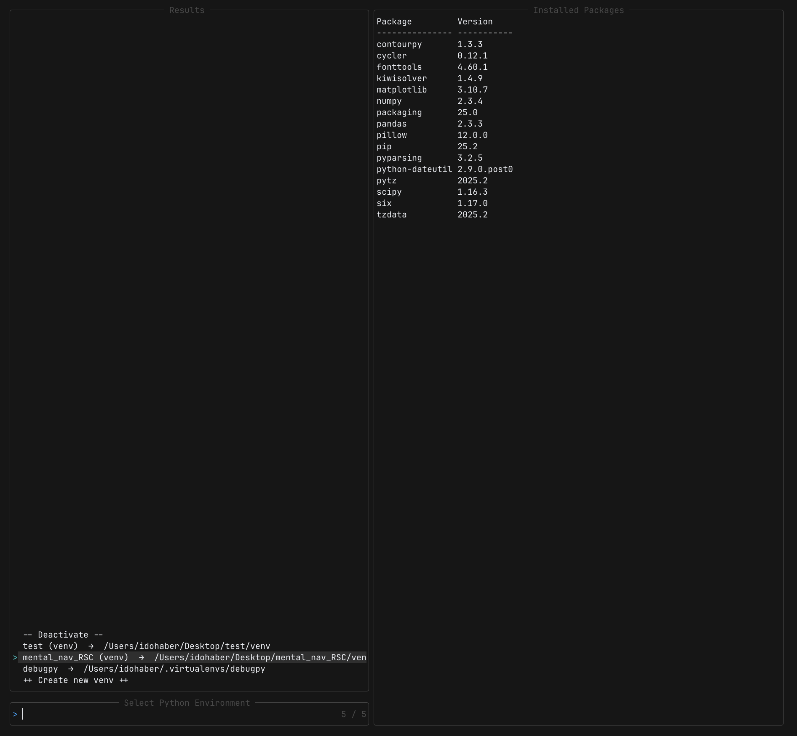

# py.nvim

A Neovim plugin for managing Python virtual environments and conda environments with lualine integration and script execution.



## Features

- Automatically discover and list venv and conda environments
- Switch between Python environments using Telescope
- Display active environment in lualine status bar
- Automatic LSP configuration for selected environment
- Project-aware environment detection
- Run Python scripts with active environment

## Installation

### lazy.nvim

```lua
{
  "idossha/py.nvim",
  dependencies = {
    "nvim-telescope/telescope.nvim",
    "nvim-lualine/lualine.nvim",
  },
  config = true,
}
```

### packer.nvim

```lua
use {
  'idossha/py.nvim',
  requires = {
    'nvim-telescope/telescope.nvim',
    'nvim-lualine/lualine.nvim',
  },
  config = function()
    require('pyenv_manager').setup()
  end
}
```

## Configuration

Default configuration:

```lua
require('pyenv_manager').setup({
  venv_paths = {
    vim.fn.expand("~/.virtualenvs"),
    vim.fn.getcwd(),
    vim.fn.expand("~/Projects"),
  },
  conda_paths = {
    vim.fn.expand("~/miniconda3/envs"),
    vim.fn.expand("~/anaconda3/envs"),
    vim.fn.expand("~/miniforge3/envs"),
  },
  venv_names = { "venv", ".venv", "env", ".env", "virtualenv" },
  parents = 2,
  show_conda = true,
  auto_activate = true,
  create_mappings = true,
  keymap_select = ",v",
  keymap_run_script = ",,",
  auto_detect_on_start = true,
  run_in_terminal = true,
  terminal_height = 15,
})
```

## Lualine Integration

Add to your lualine configuration:

```lua
local python_env = require("pyenv_manager.lualine").get_component()

require("lualine").setup({
  sections = {
    lualine_x = { python_env, "encoding", "fileformat", "filetype" },
  },
})
```

## Usage

### Commands

- `:PyenvSelect` - Open environment picker
- `:PyenvDeactivate` - Deactivate current environment
- `:PyenvInfo` - Show active environment information
- `:PyenvRunScript` - Run current Python script

### Keymaps

Default keymaps (configurable):

- `,v` - Open environment selector
- `,,` - Run current Python script

Press `q` to close terminal window when running scripts.

## License

MIT
